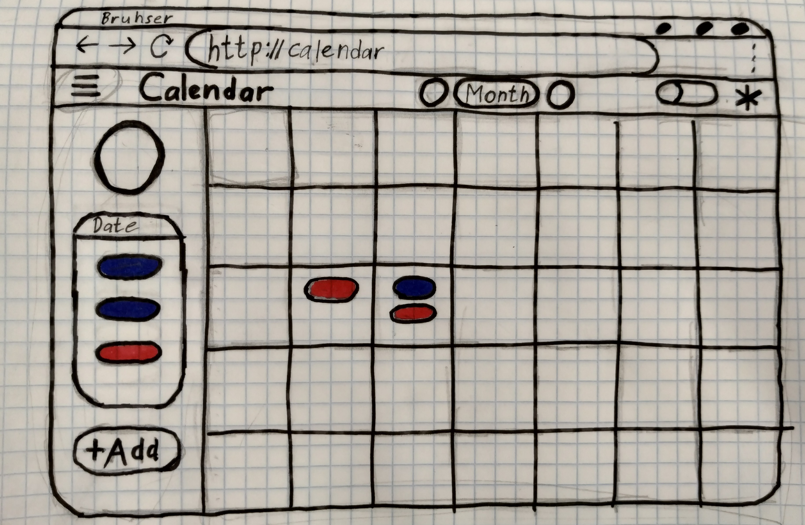

# Calendar

Calendar for tasks, events and reminders (Zhamoidzik, 953501)

## Main functions:
* Authorization (possibility of Google Account Authorization);
* Adding of task, event, reminders;
* Updating of task, event, reminders;
* Removing of task, event, reminders;

## Project models:
* User (name, surname, avatar(img))
* Task (name, description, date)
* Event (name, date, period, description)
* Reminder (name, date)

